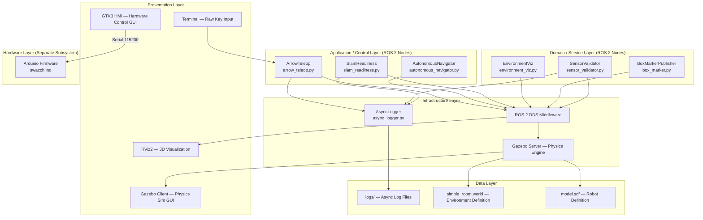
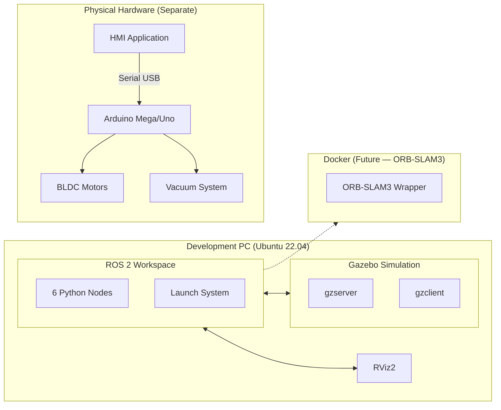

# 01 — System Architecture

## Architecture Type

**Distributed Publish-Subscribe** — The system follows ROS 2's decoupled node architecture where independent processes communicate via topic-based message passing. Each node is a separate OS process.

## Layered Architecture Diagram

## Technology Stack

| Layer | Technology |
|-------|-----------|
| **OS** | Ubuntu 22.04 LTS |
| **Middleware** | ROS 2 Humble Hawksbill (DDS) |
| **Simulator** | Gazebo Classic 11 |
| **Visualization** | RViz2 |
| **Language (Sim)** | Python 3.10 |
| **Language (HMI)** | C++ (GTK3) |
| **Language (FW)** | Arduino C++ |
| **Build System** | Colcon (ament_python) |
| **Robot Platform** | TurtleBot3 Burger (simulated) |
| **Sensors** | 2D LiDAR (360°), IMU, RGB-D Camera |

## Deployment Boundaries

> **Key Insight**: The simulation and hardware subsystems are **fully decoupled**. There is no ROS bridge between the GTK HMI/Arduino and the simulation nodes. They are designed to eventually converge when the physical robot is built.
