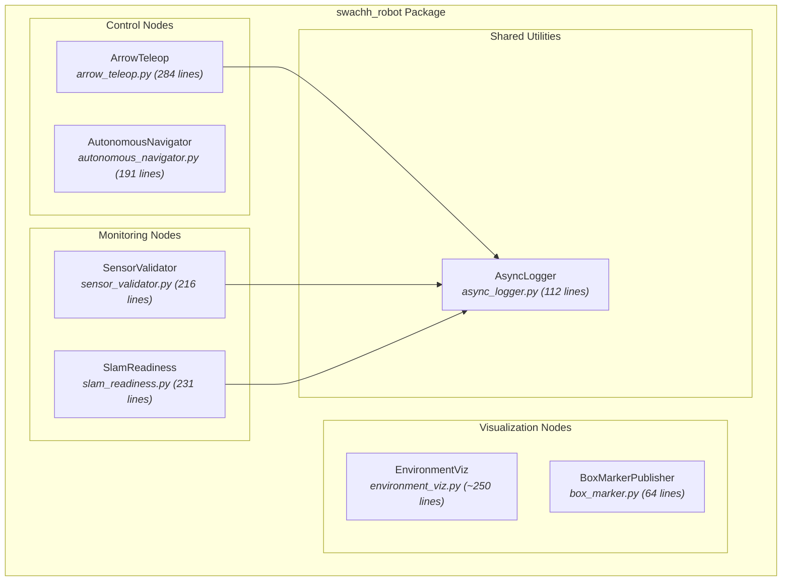
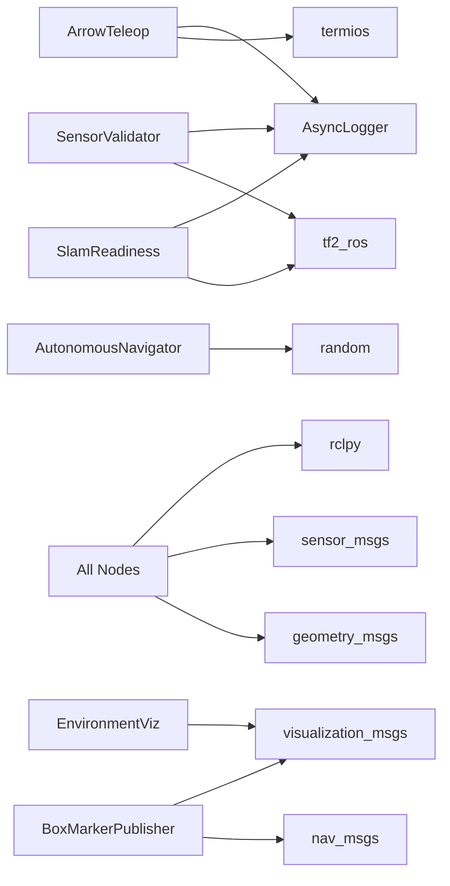

# 02 — Component Diagram (Deep Dive)

## ROS 2 Node Components

## Component Details

### ArrowTeleop (`arrow_teleop.py`)

| Attribute | Detail |
|-----------|--------|
| **ROS Name** | `arrow_teleop` |
| **Purpose** | Manual keyboard-driven robot control with collision avoidance |
| **Subscribes** | `/scan` (LaserScan) |
| **Publishes** | `/cmd_vel` (Twist) |
| **Key Classes** | `ArrowTeleop(Node)` |
| **Key Methods** | `scan_callback()`, `get_speed_factor()`, `get_effective_forward_speed()`, `process_key()`, `run()` |
| **Features** | 3 speed levels, proportional deceleration, 120° collision cone, 60° vision cone, key-hold support, raw terminal I/O |
| **Dependencies** | `async_logger`, `termios`, `statistics`, `collections` |

### AutonomousNavigator (`autonomous_navigator.py`)

| Attribute | Detail |
|-----------|--------|
| **ROS Name** | `autonomous_navigator` |
| **Purpose** | Autonomous exploration with obstacle avoidance |
| **Subscribes** | `/scan` (LaserScan) |
| **Publishes** | `/cmd_vel` (Twist) |
| **Key Classes** | `AutonomousNavigator(Node)` |
| **Key Methods** | `scan_callback()`, `control_loop()` |
| **Features** | 2-state FSM (FORWARD/TURNING), sector-based distance analysis, randomized turn direction, configurable ROS parameters |
| **Parameters** | `obstacle_distance`, `forward_speed`, `turn_speed`, `turn_duration`, `scan_sectors` |

### SensorValidator (`sensor_validator.py`)

| Attribute | Detail |
|-----------|--------|
| **ROS Name** | `sensor_validator` |
| **Purpose** | Continuous monitoring of sensor data quality and TF chain integrity |
| **Subscribes** | `/scan` (LaserScan), `/odom` (Odometry) |
| **Publishes** | None (output to log files) |
| **Key Classes** | `SensorValidator(Node)` |
| **Key Methods** | `scan_cb()`, `odom_cb()`, `report()`, `check_tf()` |
| **Features** | Rate monitoring (scan Hz, odom Hz), NaN/inf detection, TF chain validation (odom→base_footprint→base_link→base_scan), timing jitter analysis |
| **Dependencies** | `async_logger`, `tf2_ros` (optional) |

### SlamReadiness (`slam_readiness.py`)

| Attribute | Detail |
|-----------|--------|
| **ROS Name** | `slam_readiness` |
| **Purpose** | Pre-SLAM automated dry-run checks (runs for 15 seconds then exits) |
| **Subscribes** | `/scan` (LaserScan), `/odom` (Odometry) |
| **Publishes** | `/cmd_vel` (Twist — brief test pulse) |
| **Key Classes** | `SlamReadiness(Node)` |
| **7 Checks** | Scan rate, data quality, TF chain, odom rate, cmd_vel response, wall detection, frame timing |
| **Behavior** | Sends 0.1 m/s test command at t=3s, stops at t=5s, generates PASS/FAIL report at t=15s |

### EnvironmentViz (`environment_viz.py`)

| Attribute | Detail |
|-----------|--------|
| **ROS Name** | `environment_viz` |
| **Purpose** | Publishes RViz markers for walls, obstacles, and room boundaries |
| **Publishes** | `/environment_markers` (MarkerArray) |
| **Features** | Hardcoded wall positions matching `simple_room.world` exactly, color-coded rooms/corridors/obstacles |

### BoxMarkerPublisher (`box_marker.py`)

| Attribute | Detail |
|-----------|--------|
| **ROS Name** | `box_marker_publisher` |
| **Purpose** | Publishes a green cube marker at the robot's current position |
| **Subscribes** | `/odom` (Odometry) |
| **Publishes** | `/robot_marker` (Marker) |

### AsyncLogger (`async_logger.py`)

| Attribute | Detail |
|-----------|--------|
| **Purpose** | Shared async logging utility (not a ROS node) |
| **Output** | Dual file sinks in `logs/` directory + raw terminal handler |
| **Users** | `ArrowTeleop`, `SensorValidator`, `SlamReadiness` |
| **API** | `get_logger(name)`, `shutdown_logger()` |
| **Features** | Non-blocking writes, `\r\n` line endings for raw terminal compatibility |

## Hardware Subsystem Components

### HMI Application (`hmi_main.cpp`)

| Attribute | Detail |
|-----------|--------|
| **Language** | C++ with GTK3 |
| **Purpose** | Desktop GUI for controlling physical vacuum cleaner robot |
| **Communication** | Serial (115200 baud) to Arduino |
| **Controls** | Vacuum, Arm, Wiper, UV, Movement (WASD), Emergency Stop |
| **UI Elements** | Toggle buttons, directional pad, battery indicator, status labels |

### Arduino Firmware (`swacch.ino`)

| Attribute | Detail |
|-----------|--------|
| **Language** | Arduino C++ |
| **Purpose** | Low-level hardware control |
| **Protocol** | Newline-terminated ASCII commands at 115200 baud |
| **Controls** | 2× BLDC motors (YL12), vacuum relay, arm servo, wiper motor, UV strip |
| **Commands** | `VACUUM:ON/OFF`, `ARM:ON/OFF`, `WIPER:ON/OFF`, `UV:ON/OFF`, `MOVE:FORWARD/BACKWARD/LEFT/RIGHT/STOP`, `ESTOP`, `RESET` |
| **Safety** | Emergency stop halts all subsystems, status LED blinks |

## Dependency Graph

