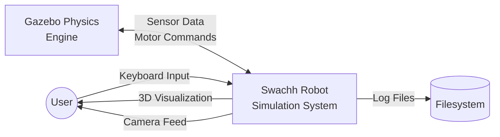
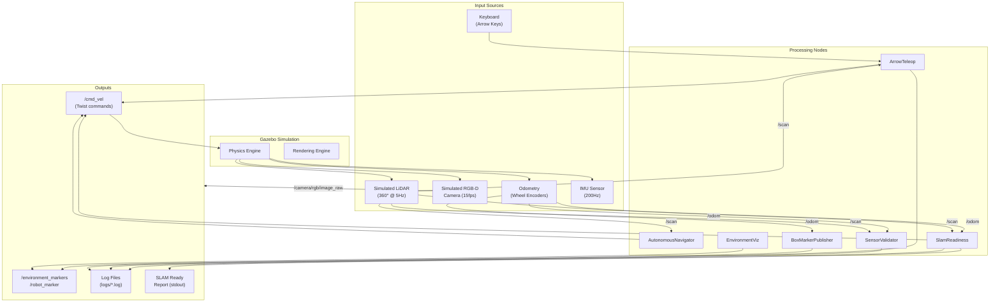
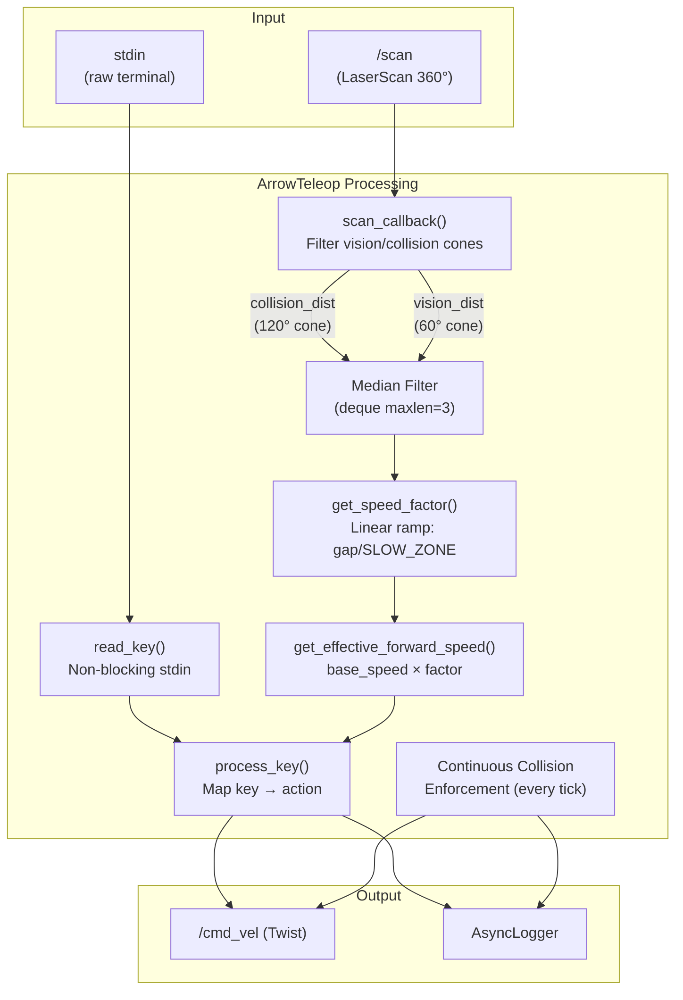

# 03 — Data Flow Diagram

## Level 0 — Context Diagram

## Level 1 — Subsystem View

## Level 2 — ArrowTeleop Internal Data Flow

This is the most complex node — it processes raw key input, LiDAR data, and produces velocity commands with collision avoidance.

## Data Transformation Details

| Stage | Input | Transformation | Output |
|-------|-------|---------------|--------|
| **LiDAR → Collision Distance** | 360 range readings | Filter to 120° front cone, take min | Single float (meters) |
| **Collision Distance → Speed Factor** | Float distance | Linear ramp: `gap / SLOW_ZONE` clamped [0, 1] | Float [0.0–1.0] |
| **Speed Factor → Effective Speed** | Factor + base speed | `speed_levels[current] × factor` | Float (m/s) |
| **Key + Speed → Twist** | Keycode + effective speed | Map to linear.x / angular.z | Twist message |
| **Scan → Sectors** | 360 readings (autonomous) | Divide into N sectors, min per sector | N floats |
| **Sectors → Turn Direction** | N sector distances | Compare left-half avg vs right-half avg | ±1 integer |

## Sync vs Async Flows

| Flow | Type | Details |
|------|------|---------|
| `/scan` → `scan_callback` | **Async** (event-driven) | ROS subscriber callback on DDS message arrival |
| Keyboard → `process_key` | **Sync** (polling) | `read_key()` polls stdin every loop iteration |
| Collision enforcement | **Sync** (continuous) | Runs every iteration of the main `while` loop |
| `report()` checks | **Async** (timer-driven) | ROS timer fires every 5s (SensorValidator) |
| Async logging | **Async** (non-blocking) | Queued writes to file, never blocks caller |
| HMI → Arduino | **Async** (serial event) | GTK button clicks trigger serial writes; Arduino processes in `loop()` |
