# 04 — Use Case Diagram

## Actors

| Actor | Type | Description |
|-------|------|-------------|
| **Operator** | Human | Controls robot via keyboard (teleop) or observes autonomous mode |
| **Gazebo** | External System | Physics simulation engine providing sensor data |
| **RViz** | External System | 3D visualization consuming marker data |
| **Arduino** | External System | Microcontroller executing hardware commands |
| **Timer** | Internal | ROS timer callbacks triggering periodic checks |

## Use Case Diagram

```mermaid
graph TB
    subgraph Actors
        Operator((Operator))
        Gazebo((Gazebo))
        RViz((RViz2))
        Arduino((Arduino))
    end

    subgraph SimUseCases["Simulation Use Cases"]
        UC1["Drive Robot Manually<br/>(Arrow Keys)"]
        UC2["Run Autonomous Navigation"]
        UC3["Observe Camera Feed"]
        UC4["View Environment in RViz"]
        UC5["Run SLAM Readiness Check"]
        UC6["Monitor Sensor Health"]
        UC7["Launch Full Simulation"]
        UC8["Adjust Speed Level<br/>(1/2/3 keys)"]
        UC9["Emergency Stop<br/>(Space key)"]
    end

    subgraph HWUseCases["Hardware Use Cases"]
        UC10["Control Vacuum On/Off"]
        UC11["Control Robot Arm"]
        UC12["Control Wipers"]
        UC13["Control UV Sanitization"]
        UC14["Manual Drive (WASD)"]
        UC15["Emergency Stop (HW)"]
        UC16["Monitor Battery"]
    end

    Operator --> UC1
    Operator --> UC2
    Operator --> UC3
    Operator --> UC4
    Operator --> UC5
    Operator --> UC7
    Operator --> UC8
    Operator --> UC9
    UC1 --> Gazebo
    UC2 --> Gazebo
    Gazebo --> UC6
    UC4 --> RViz

    Operator --> UC10
    Operator --> UC11
    Operator --> UC12
    Operator --> UC13
    Operator --> UC14
    Operator --> UC15
    Operator --> UC16
    UC10 --> Arduino
    UC11 --> Arduino
    UC12 --> Arduino
    UC13 --> Arduino
    UC14 --> Arduino
    UC15 --> Arduino
```

## Entry Points

| Entry Point | Type | File | Trigger |
|-------------|------|------|---------|
| `bash start_simulation.sh` | Shell script | `start_simulation.sh` | User launches simulation |
| `ros2 launch swachh_robot simulation.launch.py` | ROS 2 Launch | `simulation.launch.py` | Alternative launch method |
| `ros2 run swachh_robot arrow_teleop` | ROS 2 CLI | `arrow_teleop.py` | Start teleop separately |
| `ros2 run swachh_robot autonomous_navigator` | ROS 2 CLI | `autonomous_navigator.py` | Start auto-nav separately |
| `ros2 run swachh_robot slam_readiness` | ROS 2 CLI | `slam_readiness.py` | Run pre-SLAM checks |
| `ros2 run swachh_robot sensor_validator` | ROS 2 CLI | `sensor_validator.py` | Start monitoring |
| `ros2 run swachh_robot environment_viz` | ROS 2 CLI | `environment_viz.py` | Start RViz markers |
| GTK HMI Application | Desktop App | `hmi_main.cpp` | User opens HMI GUI |

## Authorization Boundaries

There are **no authentication or authorization mechanisms** in this codebase. All ROS nodes operate on the same DDS domain (default domain ID 0) with full access to all topics. The HMI communicates with Arduino over unprotected serial.
