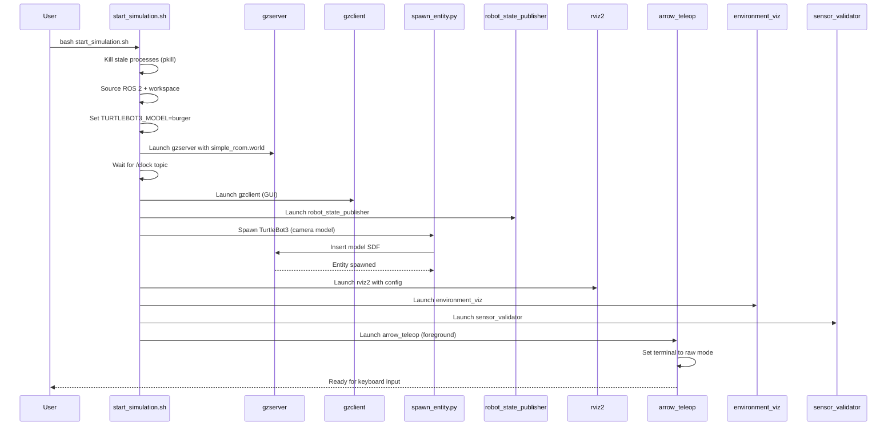
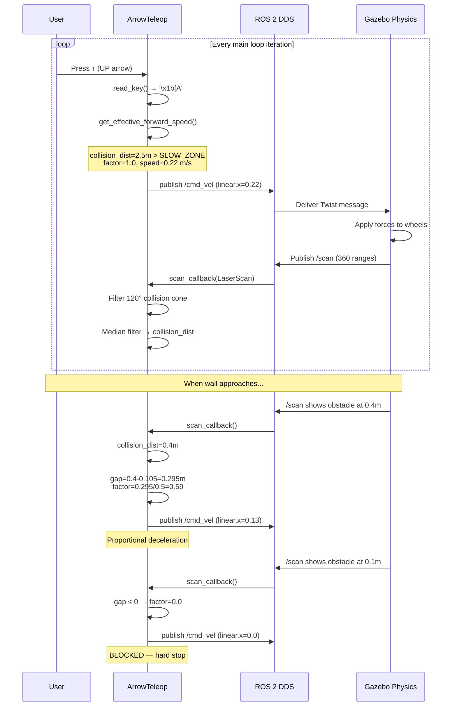
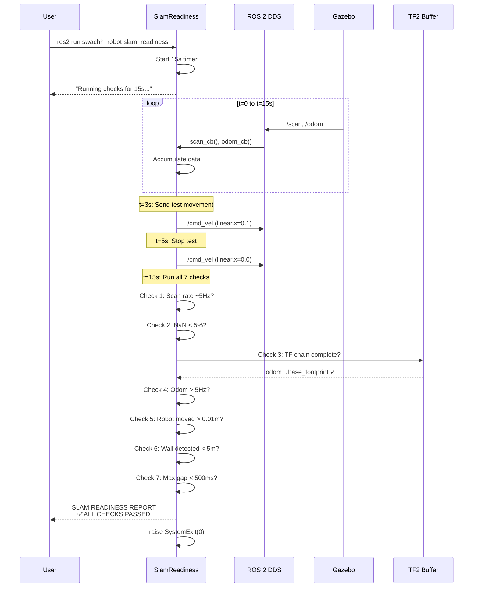
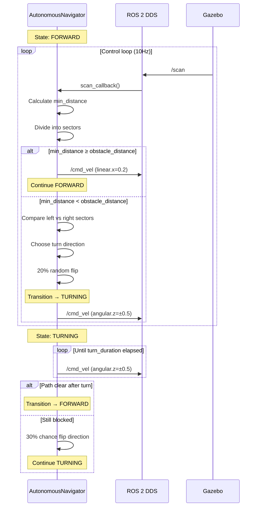
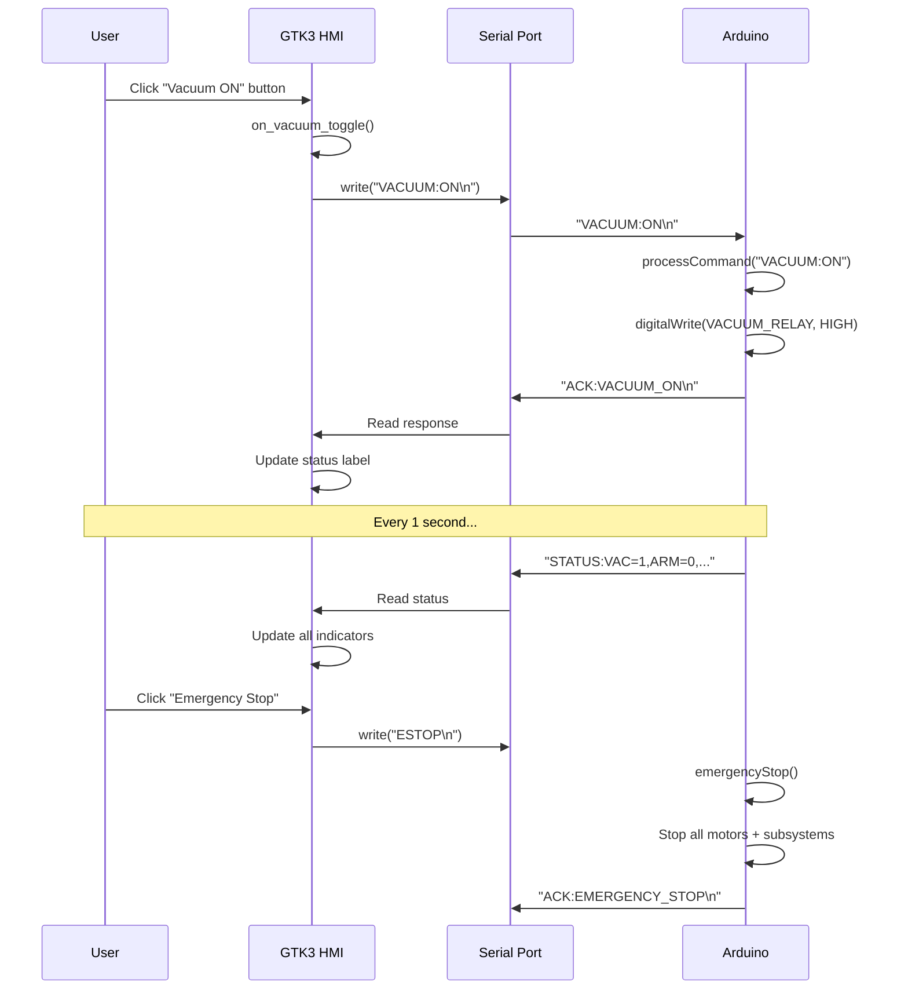

# 05 — Sequence Diagrams

## 1. Primary Workflow: Simulation Startup

## 2. Teleop Control Flow (Key Press → Robot Movement)

## 3. SLAM Readiness Check Flow

## 4. Autonomous Navigation State Transitions

## 5. HMI → Arduino Command Flow

