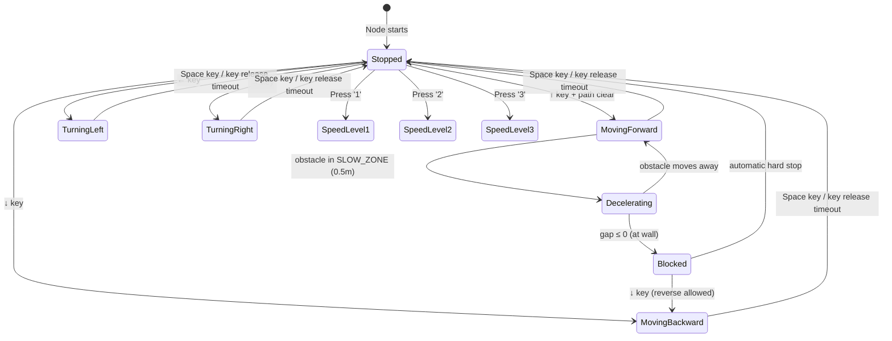
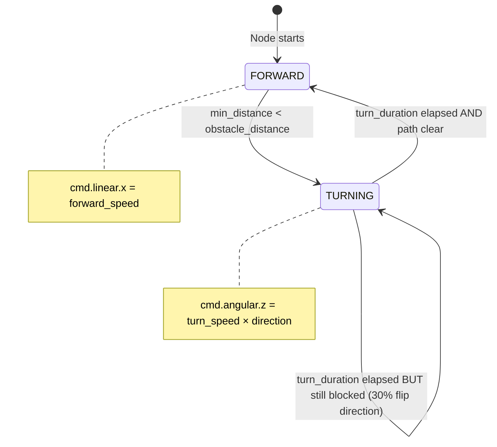
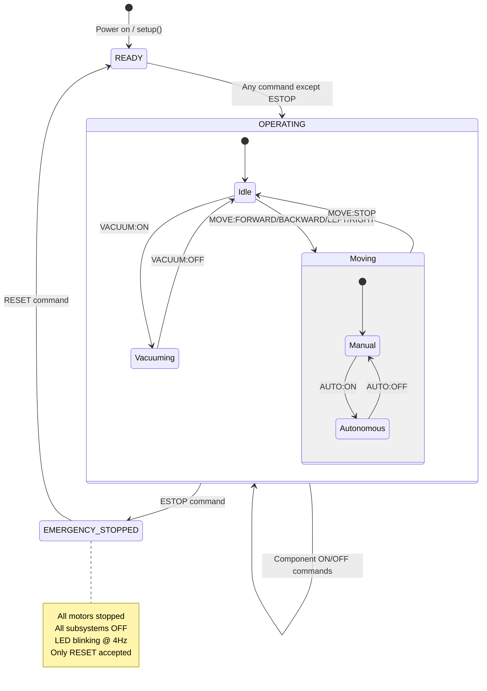
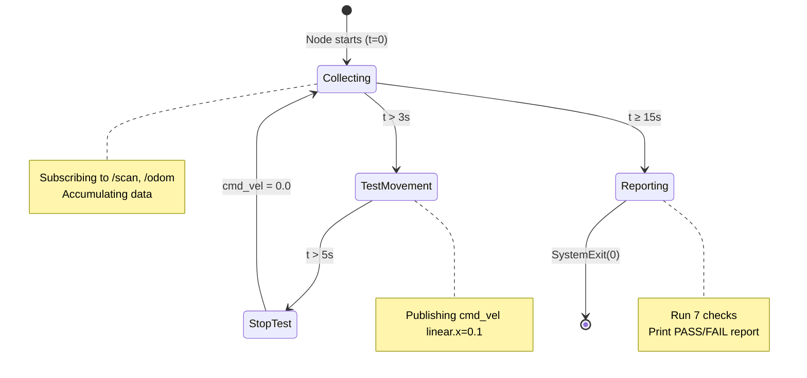

# 06 — State Model / State Machine Diagrams

## 1. ArrowTeleop — Robot Motion States

The teleop node doesn't use explicit state constants, but has implicit states driven by `current_linear` and `current_angular` values and collision proximity.

### Collision State Parameters

| State | Condition | `linear.x` |
|-------|-----------|------------|
| **Full Speed** | `gap ≥ SLOW_ZONE (0.5m)` | `speed_levels[current]` |
| **Decelerating** | `0 < gap < SLOW_ZONE` | `base_speed × (gap / SLOW_ZONE)` |
| **Blocked** | `gap ≤ 0` | `0.0` |

Where `gap = collision_dist - ROBOT_RADIUS (0.105m)` and `SLOW_ZONE = 0.5m`.

---

## 2. AutonomousNavigator — Navigation FSM

### State Details

| State | Entry Condition | Action | Exit Condition |
|-------|----------------|--------|----------------|
| `FORWARD` | Path clear (min_dist ≥ 0.5m) | Publish `linear.x = 0.2` | Obstacle detected |
| `TURNING` | Obstacle at < 0.5m | Publish `angular.z = ±0.5` | `turn_duration` (2s) elapsed + path clear |

### Turn Direction Selection Algorithm
1. Divide scan into sectors
2. Average left-half sectors vs right-half sectors
3. Turn toward side with more open space
4. 20% random flip to prevent loops

---

## 3. Arduino System State Machine

### Arduino System State Variables

| Flag | Type | Initial | Description |
|------|------|---------|-------------|
| `vacuum_active` | bool | false | Vacuum relay state |
| `arm_active` | bool | false | Robotic arm servo state |
| `wiper_active` | bool | false | Wiper motor state |
| `uv_active` | bool | false | UV strip state |
| `autonomous_mode` | bool | false | If true, rejects manual MOVE commands |
| `emergency_stop` | bool | false | If true, rejects all commands except RESET |
| `moving` | bool | false | Motors currently active |

---

## 4. SlamReadiness — Lifecycle

