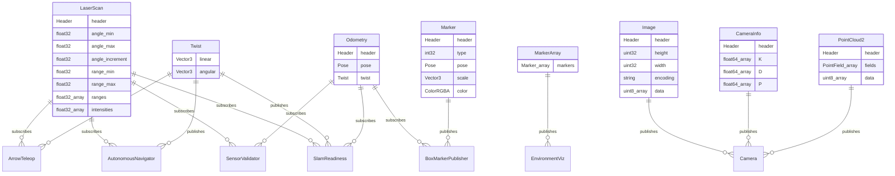
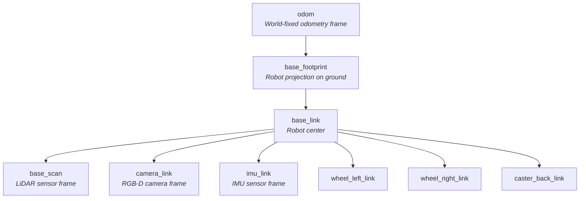

# 07 — Data Model Documentation

## Overview

This system has **no traditional database**. Data is transient, living in ROS 2 message streams and in-memory node state. Persistent data exists only as:
- **Configuration files** (SDF models, world files, URDF, RViz config)
- **Log files** (async logger output)
- **Build artifacts** (colcon output, not versioned)

---

## ROS 2 Message Types (Entity-Relationship)



---

## TF Frame Tree

The coordinate frame hierarchy, published by `robot_state_publisher` and Gazebo plugins:



### Frame Transform Sources

| Transform | Publisher | Update Rate |
|-----------|----------|-------------|
| `odom → base_footprint` | Gazebo diff_drive plugin | ~30 Hz |
| `base_footprint → base_link` | robot_state_publisher | Static |
| `base_link → base_scan` | robot_state_publisher | Static |
| `base_link → camera_link` | Gazebo camera plugin | Static |
| `base_link → imu_link` | robot_state_publisher | Static |
| Wheel/caster joints | robot_state_publisher | Static |

---

## In-Memory Data Structures

### ArrowTeleop

| Variable | Type | Purpose |
|----------|------|---------|
| `collision_dist` | float | Median-filtered min distance in 120° front cone |
| `vision_dist` | float | Median-filtered min distance in 60° front cone |
| `collision_history` | deque(maxlen=3) | Rolling buffer for median filter |
| `current_linear` | float | Current commanded linear velocity |
| `current_angular` | float | Current commanded angular velocity |
| `speed_level` | int (0–2) | Active speed tier index |
| `speed_levels` | list[3] | [0.1, 0.22, 0.5] m/s |

### SensorValidator

| Variable | Type | Purpose |
|----------|------|---------|
| `scan_times` | deque(maxlen=50) | Timestamps for Hz calculation |
| `inf_count` / `nan_count` | int | Cumulative bad data counters |
| `total_readings` | int | Total scan points received |

### AutonomousNavigator

| Variable | Type | Purpose |
|----------|------|---------|
| `current_state` | int (0/1) | FORWARD or TURNING |
| `turn_direction` | int (±1) | Current turn direction |
| `sector_distances` | list[5] | Min distance per scan sector |
| `min_distance` | float | Global minimum distance |

---

## Arduino SystemState Struct

```cpp
struct SystemState {
    bool vacuum_active;     // Vacuum relay
    bool arm_active;        // Robotic arm servo
    bool wiper_active;      // Wiper motor
    bool uv_active;         // UV sanitization strip
    bool autonomous_mode;   // Autonomous vs manual
    bool emergency_stop;    // E-stop flag
    bool moving;            // Motors active
};
```

---

## Log File Schema

Log files in `logs/` use this format:
```
YYYY-MM-DD HH:MM:SS.mmm [LEVEL] logger_name: message
```

Example:
```
2026-02-11 16:30:45.123 [INFO] sensor_validator: SCAN_RATE: 5.1Hz (expected 5Hz, deviation 2%)
2026-02-11 16:30:45.124 [INFO] sensor_validator: TF_CHAIN: complete and fresh
```
