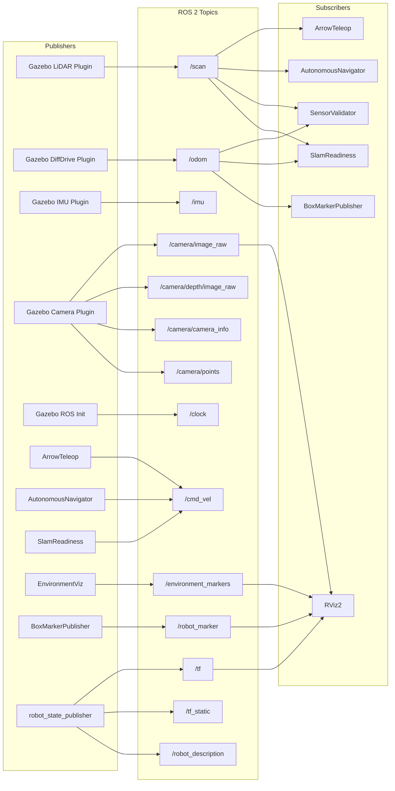

# 08 — API / ROS Topic Interaction Map

## Complete ROS Topic Map

## Topic Registry

| Topic | Message Type | Publisher | Subscriber(s) | Rate |
|-------|-------------|----------|---------------|------|
| `/scan` | `sensor_msgs/LaserScan` | Gazebo LiDAR | ArrowTeleop, AutoNav, SensorVal, SlamReady | 5 Hz |
| `/odom` | `nav_msgs/Odometry` | Gazebo DiffDrive | SensorVal, SlamReady, BoxMarker | ~30 Hz |
| `/imu` | `sensor_msgs/Imu` | Gazebo IMU | (unused — future ORB-SLAM3) | 200 Hz |
| `/cmd_vel` | `geometry_msgs/Twist` | ArrowTeleop / AutoNav / SlamReady | Gazebo DiffDrive | Variable |
| `/camera/image_raw` | `sensor_msgs/Image` | Gazebo Camera | (future ORB-SLAM3) | 15 fps |
| `/camera/depth/image_raw` | `sensor_msgs/Image` | Gazebo Camera | (future ORB-SLAM3) | 15 fps |
| `/camera/camera_info` | `sensor_msgs/CameraInfo` | Gazebo Camera | (future ORB-SLAM3) | 15 fps |
| `/camera/points` | `sensor_msgs/PointCloud2` | Gazebo Camera | (future ORB-SLAM3) | 15 fps |
| `/environment_markers` | `visualization_msgs/MarkerArray` | EnvironmentViz | RViz2 | 1 Hz |
| `/robot_marker` | `visualization_msgs/Marker` | BoxMarker | RViz2 | ~30 Hz |
| `/clock` | `rosgraph_msgs/Clock` | Gazebo | All nodes (sim time) | ~1000 Hz |
| `/tf` | `tf2_msgs/TFMessage` | robot_state_publisher, Gazebo | SensorVal, SlamReady, RViz | Variable |
| `/tf_static` | `tf2_msgs/TFMessage` | robot_state_publisher | RViz | Latched |
| `/robot_description` | `std_msgs/String` | robot_state_publisher | RViz | Latched |

## Topic Conflict Analysis

> [!WARNING]
> **`/cmd_vel` contention**: Three nodes can publish to `/cmd_vel` — `ArrowTeleop`, `AutonomousNavigator`, and `SlamReadiness`. The `start_simulation.sh` script mitigates this by only launching one at a time, but the launch file (`simulation.launch.py`) starts autonomous_navigator alongside teleop, which would cause conflicting commands.

## HMI Serial Protocol

| Direction | Format | Example |
|-----------|--------|---------|
| **HMI → Arduino** | `COMMAND:PARAM\n` | `VACUUM:ON\n` |
| **Arduino → HMI (ACK)** | `ACK:RESULT\n` | `ACK:VACUUM_ON\n` |
| **Arduino → HMI (Status)** | `STATUS:K=V,K=V,...\n` | `STATUS:VAC=1,ARM=0,...\n` |
| **Arduino → HMI (Error)** | `ERR:MESSAGE\n` | `ERR:EMERGENCY_STOP_ACTIVE\n` |

### Command Reference

| Command | Response | Effect |
|---------|----------|--------|
| `VACUUM:ON` | `ACK:VACUUM_ON` | Activate vacuum relay |
| `VACUUM:OFF` | `ACK:VACUUM_OFF` | Deactivate vacuum relay |
| `ARM:ON/OFF` | `ACK:ARM_ON/OFF` | Control robotic arm |
| `WIPER:ON/OFF` | `ACK:WIPER_ON/OFF` | Control wiper motor |
| `UV:ON/OFF` | `ACK:UV_ON/OFF` | Control UV strip |
| `MOVE:FORWARD` | `ACK:MOVE_FORWARD` | Drive forward (manual only) |
| `MOVE:BACKWARD` | `ACK:MOVE_BACKWARD` | Drive backward (manual only) |
| `MOVE:LEFT` | `ACK:TURN_LEFT` | Turn left (manual only) |
| `MOVE:RIGHT` | `ACK:TURN_RIGHT` | Turn right (manual only) |
| `MOVE:STOP` | `ACK:MOTORS_STOPPED` | Stop all motors |
| `AUTO:ON/OFF` | `ACK:AUTO_MODE_ON/OFF` | Toggle autonomous mode |
| `ESTOP` | `ACK:EMERGENCY_STOP` | Emergency stop all systems |
| `RESET` | `ACK:SYSTEM_RESET` | Clear emergency stop |
