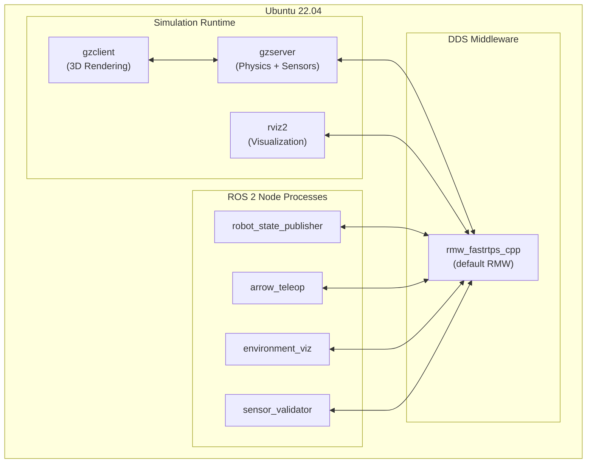
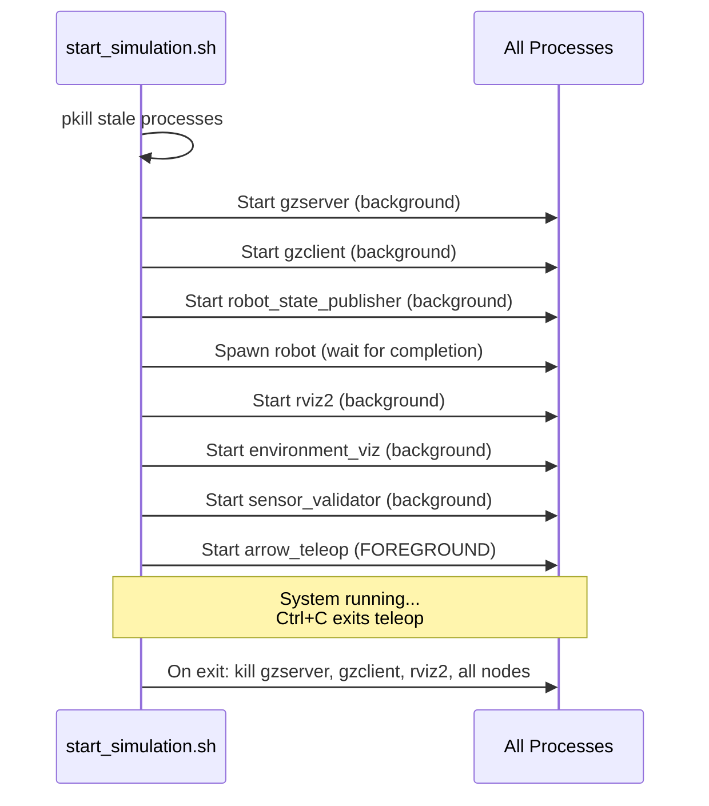

# 09 — Deployment / Runtime View

## Runtime Architecture



## How to Run the System

### Method 1: Shell Script (Recommended)

```bash
cd ~/Desktop/swachh-robot-simulation
bash start_simulation.sh
```

**This script performs:**
1. Kills stale processes (`gzserver`, `gzclient`, `rviz2`, all swachh_robot nodes)
2. Sources ROS 2 Humble setup and workspace overlay
3. Sets `TURTLEBOT3_MODEL=burger` and `GAZEBO_MODEL_PATH`
4. Sets `LIBGL_ALWAYS_SOFTWARE=1` (software rendering fallback)
5. Launches `gzserver` with `simple_room.world` and waits for `/clock`
6. Launches `gzclient`
7. Launches `robot_state_publisher`
8. Spawns the custom camera-equipped TurtleBot3 model
9. Launches `rviz2` with saved config
10. Launches `environment_viz` and `sensor_validator` in background
11. Launches `arrow_teleop` in foreground (interactive)

### Method 2: ROS 2 Launch File

```bash
source /opt/ros/humble/setup.bash
source ~/Desktop/swachh-robot-simulation/install/setup.bash
export TURTLEBOT3_MODEL=burger
ros2 launch swachh_robot simulation.launch.py
```

> [!NOTE]
> The launch file uses the **stock** TurtleBot3 model (no camera). Use the shell script for the camera-equipped model.

## Required Services & Dependencies

### System Packages

| Package | Version | Purpose |
|---------|---------|---------|
| `ros-humble-desktop` | Humble | Core ROS 2 + RViz2 |
| `ros-humble-gazebo-ros-pkgs` | Humble | Gazebo-ROS integration |
| `ros-humble-turtlebot3-gazebo` | Humble | TurtleBot3 models + worlds |
| `ros-humble-turtlebot3-description` | Humble | URDF/SDF descriptions |
| `ros-humble-tf2-ros` | Humble | TF frame management |
| `gazebo` | 11.x | Classic physics simulator |
| Python 3.10 | 3.10.x | Runtime for ROS 2 nodes |

### Environment Variables

| Variable | Value | Purpose |
|----------|-------|---------|
| `TURTLEBOT3_MODEL` | `burger` | Selects robot model (required) |
| `GAZEBO_MODEL_PATH` | `/opt/ros/humble/share/turtlebot3_gazebo/models` | Gazebo model search path |
| `LIBGL_ALWAYS_SOFTWARE` | `1` | Forces Mesa software rendering (for VMs/no GPU) |
| `ROS_DOMAIN_ID` | `0` (default) | DDS domain for inter-node communication |

## Config-Driven Behavior

| Config File | Format | Controls |
|-------------|--------|----------|
| `simple_room.world` | SDF/XML | Room geometry, wall colors, lighting, poster panels |
| `model.sdf` | SDF/XML | Robot geometry, sensors, plugins |
| `robot_view.rviz` | YAML | RViz display configuration, topics, camera angles |
| `simulation.launch.py` | Python | Node startup sequence, parameters, delays |

### Tunable Node Parameters

| Node | Parameter | Default | Config Method |
|------|-----------|---------|---------------|
| AutonomousNavigator | `obstacle_distance` | 0.5 m | ROS param / launch file |
| AutonomousNavigator | `forward_speed` | 0.2 m/s | ROS param / launch file |
| AutonomousNavigator | `turn_speed` | 0.5 rad/s | ROS param / launch file |
| AutonomousNavigator | `turn_duration` | 2.0 s | ROS param / launch file |
| AutonomousNavigator | `scan_sectors` | 5 | ROS param / launch file |
| ArrowTeleop | Speed levels | [0.1, 0.22, 0.5] | Hardcoded |
| ArrowTeleop | SLOW_ZONE | 0.5 m | Hardcoded |
| ArrowTeleop | ROBOT_RADIUS | 0.105 m | Hardcoded |
| SensorValidator | Report interval | 5s | Hardcoded |
| SlamReadiness | CHECK_DURATION | 15s | Hardcoded constant |

## Scaling Assumptions

- **Single robot**: The system is designed for a single TurtleBot3 instance. All topics use global names without namespacing.
- **Single machine**: All nodes run on the same machine. No multi-machine DDS configuration.
- **Software rendering**: The `LIBGL_ALWAYS_SOFTWARE=1` flag indicates the deployment target may lack a GPU. This limits Gazebo rendering performance.
- **No persistence**: No database, no message recording. All state is ephemeral.

## Process Lifecycle


